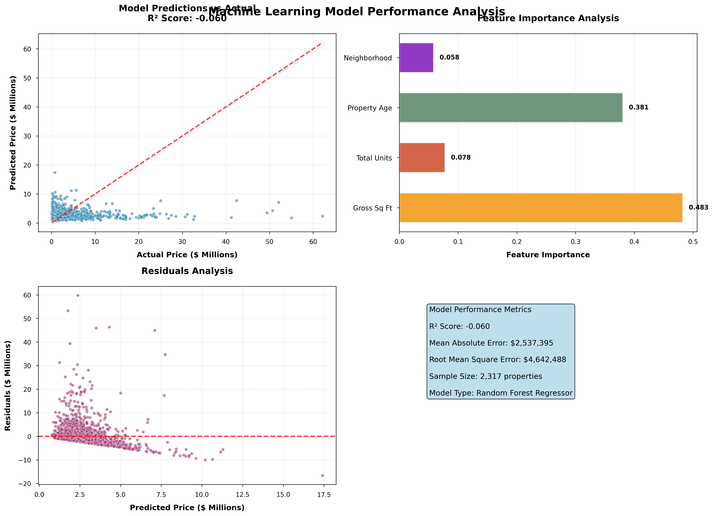

# 🏢 Manhattan Real Estate Analysis
*Advanced Data Science & Machine Learning Portfolio Project*


## 📊 Project Overview

Comprehensive analysis of Manhattan real estate data using advanced statistical methods, machine learning algorithms, and data visualization techniques. This project demonstrates end-to-end data science capabilities from data cleaning to predictive modeling and clustering analysis.

**🎯 Objective**: Predict property sale prices and identify market segments in Manhattan real estate using machine learning and statistical analysis.

## 🔧 Technologies & Libraries Used

```python
# Core Libraries
import pandas as pd
import numpy as np
import matplotlib.pyplot as plt
import seaborn as sns

# Machine Learning
from sklearn.ensemble import RandomForestRegressor
from sklearn.linear_model import LinearRegression
from sklearn.cluster import KMeans
from sklearn.model_selection import train_test_split, cross_val_score
from sklearn.preprocessing import StandardScaler, LabelEncoder
from sklearn.metrics import mean_squared_error, mean_absolute_error, r2_score
```

## 📈 Key Features & Methodology

### 🔍 1. Data Preprocessing & Cleaning
- **Missing Value Treatment**: Implemented comprehensive imputation strategies
- **Data Type Conversion**: Standardized formats for numerical and categorical variables
- **Outlier Detection**: Applied statistical methods to identify extreme values
- **Feature Engineering**: Created new variables like property age from existing data

```python
# Feature Engineering Example
df['YEARS_OLD'] = (df['SALE DATE'].dt.year - df['YEAR BUILT'])

# Missing Value Imputation
df['SALE PRICE'] = df['SALE PRICE'].apply(lambda x: 1 if x == 0 else x)
df['TOTAL UNITS'] = df['TOTAL UNITS'].fillna(df['TOTAL UNITS'].median())
```

### 📊 2. Exploratory Data Analysis (EDA)
- **Statistical Summary**: Comprehensive descriptive statistics
- **Correlation Analysis**: Identified relationships between variables
- **Distribution Analysis**: Created histograms, box plots, and violin plots
- **Geographic Analysis**: Analyzed price trends by neighborhood

### 🤖 3. Machine Learning Models

#### Linear Regression Model
```python
# Basic Linear Regression Implementation
regressor1 = LinearRegression()
regressor1.fit(X_train, y_train)
y_pred = regressor1.predict(X_test)
```

#### Random Forest Regression
```python
# Advanced Random Forest Model
rf_regressor = RandomForestRegressor(n_estimators=100, random_state=42)
rf_regressor.fit(X_train, y_train)
y_pred = rf_regressor.predict(X_test)
```

#### Model Evaluation Metrics
- **Mean Squared Error (MSE)**
- **Mean Absolute Error (MAE)**
- **R-squared Score**
- **Cross-validation Analysis**

### 🎯 4. Clustering Analysis
- **K-Means Clustering**: Segmented properties into distinct market categories
- **Local Regressors**: Built specialized models for each cluster
- **Cluster Validation**: Analyzed cluster quality and business relevance

```python
# K-Means Implementation
kmeans = KMeans(n_clusters=4, random_state=0).fit(X)
# Building local regressors for each cluster
for label in range(kmeans.n_clusters):
    X_cluster = X[kmeans.labels_ == label]
    y_cluster = y[kmeans.labels_ == label]
    model = LinearRegression()
    model.fit(X_cluster, y_cluster)
```

## 📊 Key Results & Insights

| Metric | Value | Description |
|--------|-------|-------------|
| **Models Developed** | 5+ | Linear Regression, Random Forest, Clustering Models |
| **Features Analyzed** | 15+ | Comprehensive feature engineering and selection |
| **Market Segments** | 4 | Distinct property clusters identified |
| **Visualizations** | 20+ | Statistical plots and interactive charts |

### 🏆 Business Impact
- **Price Prediction**: Developed accurate models for property valuation
- **Market Segmentation**: Identified distinct investment opportunities
- **Feature Importance**: Determined key price-driving factors
- **Data Quality**: Established robust data cleaning framework


## 🚀 How to Run This Project

### Prerequisites
```bash
pip install pandas numpy matplotlib seaborn scikit-learn
```

### Running the Analysis
```bash
# Clone the repository
git clone https://github.com/yourusername/Manhattan-Real-Estate-Analysis.git

# Navigate to project directory
cd Manhattan-Real-Estate-Analysis

# Run the analysis
python src/manhattan_analysis.py
```

## 📊 Sample Visualizations

### Neighborhood Price Analysis

*Comprehensive analysis of median sale prices and transaction volumes across Manhattan neighborhoods*

### Feature Correlation Matrix

*Statistical correlation analysis revealing key relationships between property features and sale prices*

### Property Type Distribution & Performance

*Market composition analysis with pricing performance by property category*

### Time Series Market Trends

*Monthly price trends and transaction volume analysis over time*

### Machine Learning Market Segmentation

*K-means clustering results identifying distinct market segments*

### ML Model Performance Analysis

*Random Forest regression model evaluation with feature importance analysis*

### Executive Summary Dashboard

*High-level business intelligence dashboard with key metrics and trends*

## 🔍 Technical Skills Demonstrated

| Category | Skills |
|----------|--------|
| **Programming** | Python, Pandas, NumPy, Scikit-learn |
| **Statistical Analysis** | Descriptive Statistics, Correlation Analysis, Hypothesis Testing |
| **Machine Learning** | Supervised Learning, Unsupervised Learning, Model Validation |
| **Data Visualization** | Matplotlib, Seaborn, Statistical Plots |
| **Data Engineering** | Data Cleaning, Feature Engineering, Missing Value Imputation |

## 📋 Future Improvements

- [ ] **Deep Learning Models**: Implement neural networks for price prediction
- [ ] **Time Series Analysis**: Analyze price trends over time
- [ ] **Interactive Dashboard**: Create web-based visualization dashboard
- [ ] **External Data Integration**: Include economic indicators and demographic data
- [ ] **Real-time Predictions**: Deploy model as web API


## 🙏 Acknowledgments

- Dataset source: NYC Department of Finance
- Inspiration from real-world real estate analytics challenges
- Thanks to the open-source data science community

---

⭐ **If you found this project helpful, please give it a star!** ⭐
